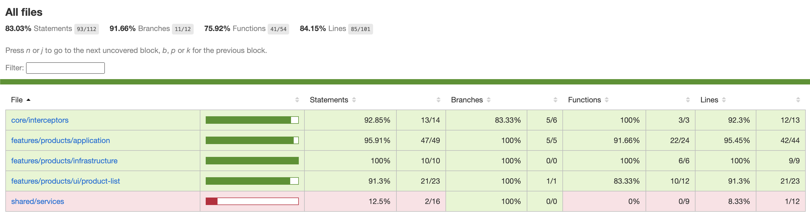

# Productos Financieros - Angular 19

Aplicación para la gestión de productos financieros construida con Angular 19 que permite listar, buscar, crear, editar y eliminar productos financieros de un banco.

## Requisitos previos

- Node.js (v16 o superior)
- Angular CLI v19
- Backend funcionando en `http://localhost:3002`

## Instalación

Para instalar las dependencias del proyecto, ejecuta:

```bash
npm install
```

## Ejecución del proyecto

Para iniciar el servidor de desarrollo:

```bash
ng serve
```

La aplicación estará disponible en `http://localhost:4200/`.

## Pruebas unitarias y cobertura

Para ejecutar las pruebas unitarias y generar el informe de cobertura:

```bash
ng test --code-coverage
```

Este comando generará un informe detallado de la cobertura en la carpeta `/coverage` del proyecto, donde podrás ver el porcentaje de cobertura por archivo.

## Capturas de cobertura de código


